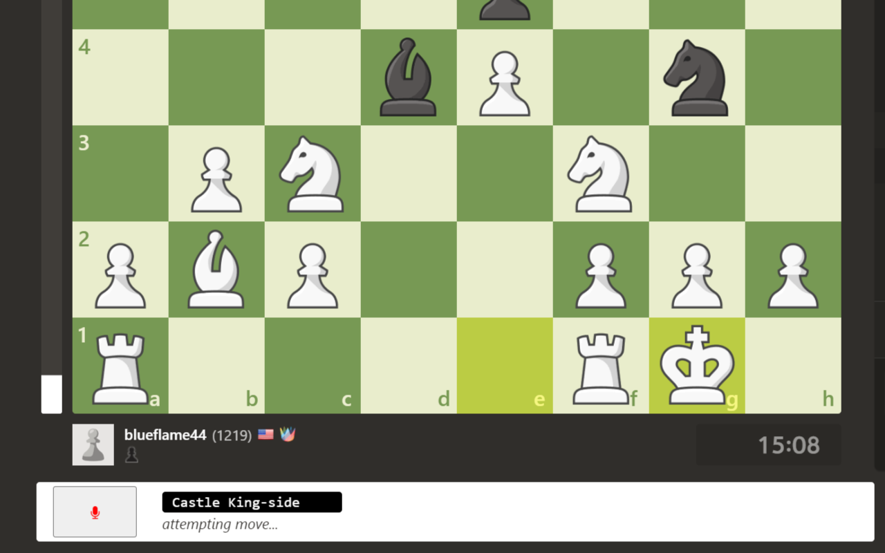

# Speak to Chess.com (Standard Notation)
Source code for [the Chrome extension](https://chrome.google.com/webstore/detail/speak-to-chesscom-standar/jhfacpfmnjeambcapipomocgnjmjgbaf).

## Overview
Play hands-free on [chess.com](https://www.chess.com) by dictating moves in [standard chess notation](https://en.wikipedia.org/wiki/Algebraic_notation_(chess)).

### Background
[lichess.org](https://lichess.org) has implemented voice commands, but [chess.com](https://www.chess.com) does not have this feature.

## Move by Voice
Provides validation & feedback.
|  |  |
:----:|:----:
|  |  |

## Architecture
### Flow
- Add extension's HTML elements.
- On speech recognition results:
  - Preprocess (e.g. translate "queen play seven" to "Queen a7").
  - Validate the command. Provide feedback if invalid.
  - Execute the move (simulate two clicks).

### Leverages
- Chrome's webkitSpeechRecognition toolkit.
- The HTML classes on [chess.com](https://www.chess.com).

## Inspiration
This project is derived from some great work from [parsec209](https://github.com/parsec209/chess.com-voice-input/tree/main), who built a tool to click board coordinates like "56" on [chess.com](https://www.chess.com).

This project simplifies & expedites voice commands with the expressive standard notation. For example, we can now move with the command "Knight f3" instead of the two commands "71 (wait) 63".

I wish I knew that "Speak to Lichess" existed before building this project (could have probably re-used some code). Nonetheless, the name served as inspiration.
